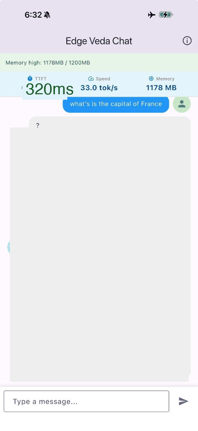

# Edge Veda SDK

**On-device AI SDK — LLM, STT, TTS across Flutter, iOS, Android, React Native & Web**

[](LICENSE)
[](https://github.com/ramanujammv1988/edge-veda/actions)
[](https://github.com/ramanujammv1988/edge-veda)
[](CONTRIBUTING.md)

**Knowledge at the Edge** - A unified, high-performance SDK for running AI models (LLM, STT, TTS) directly on-device across Flutter, iOS, Android, React Native, and Web platforms.

## Demo



## Overview

Edge Veda enables developers to integrate powerful AI capabilities into their applications with:
- **Sub-200ms latency** - Fast, responsive AI interactions
- **100% on-device processing** - Complete privacy, zero server costs
- **Offline-first** - Works in airplane mode and areas with poor connectivity
- **Cross-platform** - Single C++ core with native wrappers for 6+ platforms
- **Production-ready** - Optimized for mobile with <25MB binary footprint (excluding models)

## Architecture

```
┌─────────────────────────────────────────────────────────────────┐
│                     Application Layer                            │
│  ┌──────────┬──────────┬──────────┬──────────┬──────────────┐  │
│  │ Flutter  │  Swift   │  Kotlin  │ React    │ Flutter Web  │  │
│  │ (Dart)   │ (iOS/Mac)│ (Android)│ Native   │   (WASM)     │  │
│  └─────┬────┴────┬─────┴────┬─────┴────┬─────┴──────┬───────┘  │
│        │         │          │          │            │           │
│        │ Dart    │ Swift    │   JNI    │    JSI     │  WASM    │
│        │  FFI    │  API     │          │            │          │
└────────┼─────────┼──────────┼──────────┼────────────┼───────────┘
         │         │          │          │            │
         └─────────┴──────────┴──────────┴────────────┘
                              │
         ┌────────────────────┴───────────────────────┐
         │         Edge Veda C++ Core                 │
         │  ┌──────────────────────────────────────┐ │
         │  │   Inference Engines                  │ │
         │  │  • llama.cpp  (LLM)                  │ │
         │  │  • whisper.cpp (STT)                 │ │
         │  │  • Kokoro-82M (TTS)                  │ │
         │  └──────────────────────────────────────┘ │
         │  ┌──────────────────────────────────────┐ │
         │  │   Hardware Acceleration              │ │
         │  │  • Metal (iOS/macOS)                 │ │
         │  │  • Vulkan/NNAPI (Android)            │ │
         │  │  • WebGPU (Web)                      │ │
         │  └──────────────────────────────────────┘ │
         │  ┌──────────────────────────────────────┐ │
         │  │   Model Management                   │ │
         │  │  • GGUF/ONNX 4-bit quantization      │ │
         │  │  • Memory watchdog                   │ │
         │  │  • Local storage & checksums         │ │
         │  └──────────────────────────────────────┘ │
         └────────────────────────────────────────────┘
```

## Platform Support Matrix

| Platform | Integration Method | Hardware Acceleration | Status |
|----------|-------------------|----------------------|---------|
| **Flutter (iOS/Android)** | Dart FFI | Metal / Vulkan | ✅ Active |
| **Swift (iOS/macOS)** | Swift Package (XCFramework) | Metal | ✅ Active |
| **Kotlin (Android)** | JNI / AAR Library | Vulkan / NNAPI | ✅ Active |
| **React Native** | JSI (TurboModules) | Metal / Vulkan | ✅ Active |
| **Flutter Web** | WASM / Emscripten | WebGPU | 🚧 In Progress |
| **Desktop (Win/Linux)** | Native C++ | Vulkan | 📋 Planned |

## Quick Start

### Prerequisites

- **macOS/iOS**: Xcode 14+, CMake 3.21+
- **Android**: Android NDK r25+, CMake 3.21+
- **Flutter**: Flutter 3.10+
- **React Native**: Node 18+, React Native 0.72+

### 5-Minute Setup

```bash
# Clone the repository
git clone https://github.com/ramanujammv1988/edge-veda.git
cd edge-veda

# Run the setup script
./scripts/setup.sh

# Build for your platform
make build-macos    # macOS native
make build-ios      # iOS (requires macOS)
make build-android  # Android
```

### Flutter Example

```dart
import 'package:edge_veda/edge_veda.dart';

void main() async {
  // Initialize the SDK
  final veda = EdgeVeda();
  await veda.initialize();

  // Load a model
  await veda.loadModel('llama-3.2-1b-instruct-q4.gguf');

  // Generate streaming response
  await for (final chunk in veda.generateStream('What is AI?')) {
    print(chunk);
  }
}
```

### Swift Example

```swift
import EdgeVeda

let veda = EdgeVeda()
veda.initialize()

// Load model
try await veda.loadModel("llama-3.2-1b-instruct-q4.gguf")

// Generate text
for try await chunk in veda.generateStream(prompt: "What is AI?") {
    print(chunk)
}
```

### Kotlin Example

```kotlin
import com.edgeveda.sdk.EdgeVeda

val veda = EdgeVeda()
veda.initialize()

// Load model
veda.loadModel("llama-3.2-1b-instruct-q4.gguf")

// Generate text
veda.generateStream("What is AI?").collect { chunk ->
    println(chunk)
}
```

## Features

### Text-to-Text (LLM)
- **Models**: Llama 3.2 1B, Phi-3.5 Mini
- **Capabilities**: Streaming responses, JSON mode, system prompting
- **Performance**: >15 tokens/sec on mid-range mobile devices
- **API**: `generateStream(prompt, options)`

### Speech-to-Text (STT)
- **Models**: Whisper Tiny/Base, Moonshine Tiny
- **Capabilities**: Real-time transcription, multi-language support, Voice Activity Detection (VAD)
- **Performance**: Sub-500ms latency for short audio clips
- **API**: `transcribe(audioBuffer)`

### Text-to-Speech (TTS)
- **Models**: Kokoro-82M
- **Capabilities**: Neural synthesis, adjustable pitch/rate
- **Performance**: <100ms time-to-first-audio
- **API**: `speak(text)`

## Build Instructions

### Building the C++ Core

```bash
# Create build directory
mkdir -p build && cd build

# Configure
cmake .. -DCMAKE_BUILD_TYPE=Release

# Build
cmake --build . -j$(nproc)

# Run tests
ctest --output-on-failure
```

### Building for iOS

```bash
# Build iOS framework
make build-ios

# Output: build/ios/EdgeVeda.xcframework
```

### Building for Android

```bash
# Set NDK path
export ANDROID_NDK=/path/to/ndk

# Build Android AAR
make build-android

# Output: build/android/edgeveda.aar
```

### Building for Web (WASM)

```bash
# Requires Emscripten SDK
source /path/to/emsdk/emsdk_env.sh

# Build WASM
make build-wasm

# Output: build/wasm/edgeveda.wasm
```

## Development

### Project Structure

```
edge-veda/
├── core/                   # C++ inference engine
│   ├── include/           # Public headers
│   ├── src/               # Implementation
│   ├── third_party/       # Dependencies (llama.cpp, whisper.cpp)
│   └── cmake/             # Build toolchains
├── flutter/               # Flutter plugin
│   ├── lib/              # Dart code
│   ├── ios/              # iOS FFI bindings
│   └── android/          # Android JNI bindings
├── swift/                 # Swift Package
│   └── Sources/
├── kotlin/                # Kotlin/Android SDK
│   └── src/
├── react-native/          # React Native module
│   └── src/
├── web/                   # Web WASM wrapper
│   └── src/
├── scripts/               # Build and setup scripts
└── .github/workflows/     # CI/CD pipelines
```

### Running Tests

```bash
# Run all tests
make test

# Run C++ tests only
cd build && ctest

# Run Flutter tests
cd flutter && flutter test

# Run platform-specific tests
make test-ios
make test-android
```

### Code Formatting

```bash
# Format all code
make format

# C++ (clang-format)
find core -name "*.cpp" -o -name "*.h" | xargs clang-format -i

# Dart (dart format)
cd flutter && dart format .

# Swift (swiftformat)
swiftformat swift/
```

## Performance Benchmarks

| Device | Model | Tokens/sec | Time-to-First-Token | Memory |
|--------|-------|-----------|---------------------|---------|
| iPhone 14 Pro | Llama 3.2 1B Q4 | 24 tok/s | 180ms | 1.2GB |
| Samsung S23 | Llama 3.2 1B Q4 | 18 tok/s | 220ms | 1.3GB |
| iPad Pro M2 | Phi-3.5 Mini Q4 | 32 tok/s | 150ms | 1.8GB |
| Pixel 7 | Whisper Tiny | - | 320ms | 400MB |

## Comparison vs Alternatives

| Feature | Edge Veda | MediaPipe LLM | ML Kit | CoreML (Raw) |
|---------|-----------|---------------|--------|--------------|
| **Cross-Platform** | ✅ Flutter, RN, iOS, Android, Web | ✅ Android, Web, iOS | ✅ Android, iOS | ❌ Apple Only |
| **LLM Support** | ✅ Llama 3.2, Phi-3.5, etc. | ✅ Gemma, Phi-2, Falcon | ❌ No LLM | ✅ Custom |
| **Speech-to-Text** | ✅ Whisper (High Accuracy) | ❌ | ❌ | ✅ |
| **Text-to-Speech** | ✅ High Quality Neural | ❌ | ❌ | ✅ |
| **Privacy** | ✅ 100% On-Device | ✅ On-Device | ⚠️ Cloud/On-Device Mix | ✅ On-Device |

## Documentation

- [Architecture Guide](docs/architecture.md)
- [API Reference](docs/api-reference.md)
- [Platform Integration Guides](docs/platforms/)
  - [Flutter Integration](docs/platforms/flutter.md)
  - [Swift/iOS Integration](docs/platforms/swift.md)
  - [Kotlin/Android Integration](docs/platforms/kotlin.md)
  - [React Native Integration](docs/platforms/react-native.md)
- [Model Management](docs/models.md)
- [Performance Optimization](docs/performance.md)
- [Troubleshooting](docs/troubleshooting.md)

## Contributing

We welcome contributions! Please see [CONTRIBUTING.md](CONTRIBUTING.md) for guidelines.

### Development Workflow

1. Fork the repository
2. Create a feature branch (`git checkout -b feature/amazing-feature`)
3. Make your changes
4. Run tests (`make test`)
5. Format code (`make format`)
6. Commit changes (`git commit -m 'Add amazing feature'`)
7. Push to branch (`git push origin feature/amazing-feature`)
8. Open a Pull Request

## Roadmap

- [x] **Phase 1**: C++ Core + Flutter SDK (Weeks 1-4)
- [x] **Phase 2**: Native SDKs (Swift, Kotlin, React Native) (Weeks 5-8)
- [ ] **Phase 3**: Voice Pipeline (STT + TTS) (Weeks 9-10)
- [ ] **Phase 4**: Web Support (WASM) (Week 8)
- [ ] **Phase 5**: Control Plane & OTA Updates (Week 11)
- [ ] **Phase 6**: Production Launch & Documentation (Week 12)

## License

[Apache 2.0](LICENSE) - See LICENSE file for details

## Support

- **Issues**: [GitHub Issues](https://github.com/ramanujammv1988/edge-veda/issues)
- **Discussions**: [GitHub Discussions](https://github.com/ramanujammv1988/edge-veda/discussions)
- **Community**: [Open a Discussion](https://github.com/ramanujammv1988/edge-veda/discussions)

## Acknowledgments

Built with:
- [llama.cpp](https://github.com/ggerganov/llama.cpp) - LLM inference
- [whisper.cpp](https://github.com/ggerganov/whisper.cpp) - Speech-to-text
- [Kokoro-82M](https://huggingface.co/hexgrad/Kokoro-82M) - Text-to-speech

---

**Made with ❤️ by the Edge Veda team**
