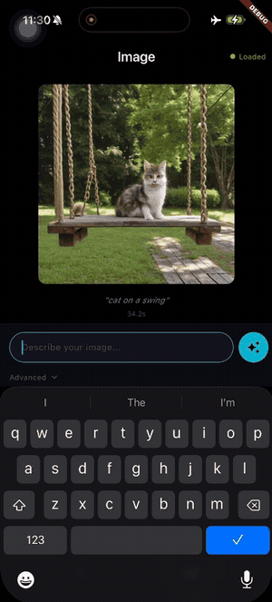
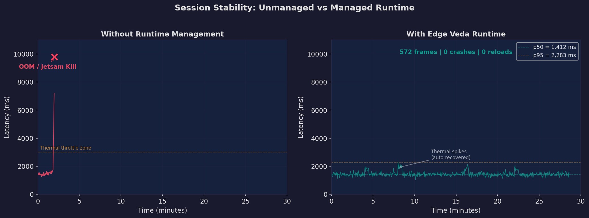
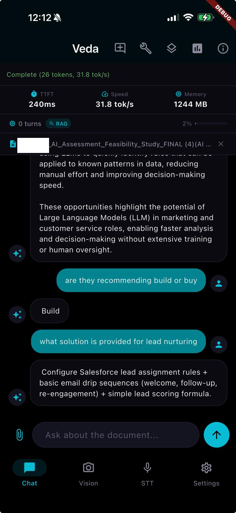
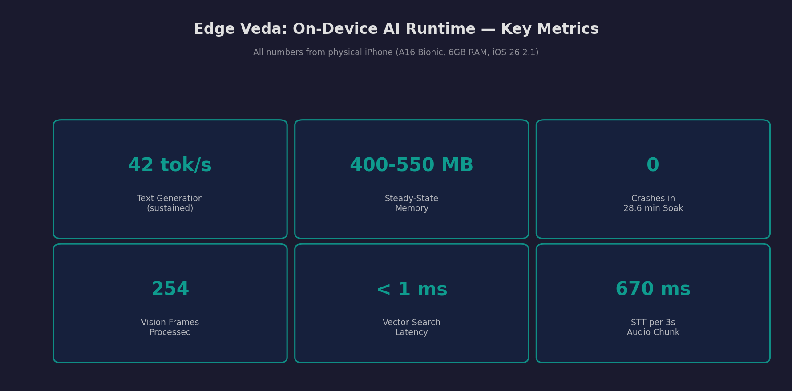
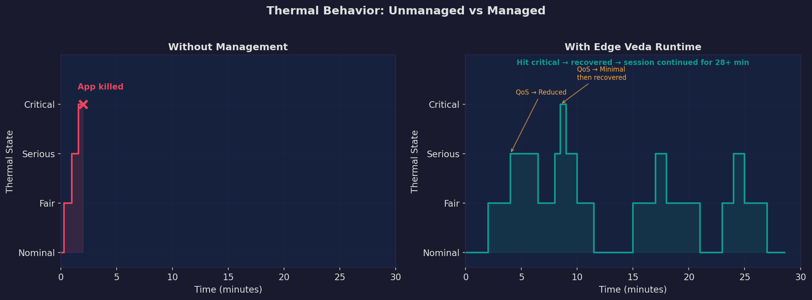
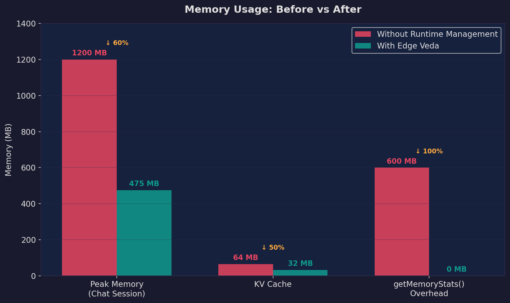

<p align="center">
  
</p>

<h1 align="center">Edge-Veda</h1>

<p align="center">
  <strong>On-device AI runtime for Flutter — text, vision, speech, image generation, and RAG.<br>Private by default. Zero cloud dependencies.</strong>
</p>

<p align="center">
  <a href="https://pub.dev/packages/edge_veda"></a>
  <a href="https://github.com/ramanujammv1988/edge-veda"></a>
  <a href="LICENSE"></a>
  <a href="https://discord.gg/zztPPRcnFC"></a>
  <a href="https://www.npmjs.com/package/@edge-veda/mcp-server"></a>
</p>

<p align="center"><em>Asking questions about a medical report — RAG retrieval + LLM generation, entirely on-device (<a href="docs/images/app_demo.mp4">full video</a>)</em></p>

---

## Table of Contents

- [Get Started](#get-started)
- [What Can It Do?](#what-can-it-do)
- [Why Edge-Veda?](#why-edge-veda)
- [Code Examples](#code-examples)
- [Supported Models](#supported-models)
- [Example Apps](#example-apps)
- [Learning Path](#learning-path)
- [Architecture](#architecture)
- [Performance](#performance)
- [Runtime Supervision](#runtime-supervision)
- [Building from Source](#building-from-source)
- [Contributing](#contributing)
- [Support](#support)

---

## Get Started

### 1. Install the package

```yaml
# pubspec.yaml
dependencies:
  edge_veda: ^2.4.0
```

### 2. Run your first inference

```dart
final edgeVeda = EdgeVeda();
await edgeVeda.init(EdgeVedaConfig(modelPath: modelPath));
final response = await edgeVeda.generate('Explain quantum computing');
print(response.text);
```

### 3. Stream tokens in real-time

```dart
await for (final chunk in edgeVeda.generateStream('Explain recursion briefly')) {
  stdout.write(chunk.token);
}
```

> **Recommended starter models:** Llama 3.2 1B for chat, Qwen3 0.6B for tool calling, SmolVLM2 for vision.

### New to iOS development?

Check the **[Quickstart Guide](flutter/QUICKSTART.md)** for step-by-step Xcode + Flutter setup.

### Prefer automated setup?

The [MCP plugin](tools/mcp-server/) automates everything — environment checks, project scaffolding, model download, and device deployment:

```bash
claude mcp add edge-veda -- npx @edge-veda/mcp-server@0.2.0
```

Then just describe what you want to build:

| Prompt | What happens |
|--------|-------------|
| *"Create an on-device chat app"* | Scaffolds project, configures iOS, downloads model, builds & deploys |
| *"Add vision capability"* | Wires SmolVLM2, model download, camera screen into existing app |
| *"Add RAG to my app"* | Adds embeddings, VectorIndex, RagPipeline, document picker UI |

---

## What Can It Do?

| Capability | Description | Key Classes |
|-----------|-------------|-------------|
| **Text Generation** | Streaming & blocking inference, multi-turn chat with auto-summarization | `EdgeVeda`, `ChatSession` |
| **Vision** | Continuous camera/image analysis with persistent VLM | `VisionWorker` |
| **Speech-to-Text** | Real-time streaming transcription via whisper.cpp (Metal GPU) | `WhisperSession` |
| **Text-to-Speech** | Neural voice synthesis with word boundary events | `TtsService` |
| **Image Generation** | On-device text-to-image via stable-diffusion.cpp (Metal GPU) | `ImageWorker` |
| **Function Calling** | Tool definitions, multi-round tool chains, schema validation | `ToolRegistry`, `ToolDefinition` |
| **Structured Output** | GBNF grammar-constrained JSON with auto-repair | `sendStructured()` |
| **Embeddings & RAG** | Vector search (HNSW), end-to-end retrieve + generate pipeline | `RagPipeline`, `VectorIndex` |
| **Runtime Supervision** | Thermal/memory/battery-aware QoS with automatic degradation | `Scheduler`, `EdgeVedaBudget` |
| **Smart Model Advisor** | Device-aware model scoring across fit, quality, speed, context | `ModelAdvisor`, `DeviceProfile` |
| **Observability** | JSONL performance traces with offline analysis tooling | `PerfTrace` |

<p align="center">
  
</p>
<p align="center"><em>"cat on a swing" → "dog riding a bicycle" — generated entirely on-device in ~30s each</em></p>

---

## Why Edge-Veda?

Most on-device AI demos break in real usage — thermal throttling, memory spikes, silent crashes after 60 seconds. Edge-Veda makes on-device AI **predictable, observable, and sustainable**.

<p align="center">
  
</p>
<p align="center"><em>Left: unmanaged runtime — latency spikes, app killed by iOS in 2 min. Right: Edge Veda — stable for 28+ min with thermal auto-recovery.</em></p>

**What makes it different:**

- Models load once, stay in memory across the entire session
- Adapts automatically to thermal, memory, and battery pressure
- Applies runtime policies instead of crashing
- Provides structured observability for debugging
- Private by default — no network calls during inference

---

## Code Examples

<details>
<summary><strong>Multi-Turn Conversation</strong></summary>

```dart
final session = ChatSession(
  edgeVeda: edgeVeda,
  preset: SystemPromptPreset.coder,
);

await for (final chunk in session.sendStream('Write hello world in Python')) {
  stdout.write(chunk.token);
}

// Model remembers the conversation
await for (final chunk in session.sendStream('Now convert it to Rust')) {
  stdout.write(chunk.token);
}

print('Turns: ${session.turnCount}');
print('Context: ${(session.contextUsage * 100).toInt()}%');
```

</details>

<details>
<summary><strong>Function Calling</strong></summary>

```dart
final tools = ToolRegistry([
  ToolDefinition(
    name: 'get_time',
    description: 'Get the current time',
    parameters: {
      'type': 'object',
      'properties': {
        'timezone': {'type': 'string', 'enum': ['UTC', 'EST', 'PST']},
      },
      'required': ['timezone'],
    },
  ),
]);

final session = ChatSession(
  edgeVeda: edgeVeda,
  tools: tools,
  templateFormat: ChatTemplateFormat.qwen3,
);

final response = await session.sendWithTools(
  'What time is it in UTC?',
  onToolCall: (call) async {
    if (call.name == 'get_time') {
      return ToolResult.success(
        toolCallId: call.id,
        data: {'time': DateTime.now().toIso8601String()},
      );
    }
    return ToolResult.failure(toolCallId: call.id, error: 'Unknown tool');
  },
);
```

</details>

<details>
<summary><strong>Speech-to-Text</strong></summary>

```dart
final session = WhisperSession(modelPath: whisperModelPath);
await session.start();

session.onSegment.listen((segment) {
  print('[${segment.startMs}ms] ${segment.text}');
});

final audioSub = WhisperSession.microphone().listen((samples) {
  session.feedAudio(samples);
});

await session.flush();
await session.stop();
print(session.transcript);
```

</details>

<details>
<summary><strong>Text-to-Speech</strong></summary>

```dart
final tts = TtsService();

final voices = await tts.availableVoices();
final voice = voices.firstWhere((v) => v.language.startsWith('en'));

tts.events.listen((event) {
  if (event.type == TtsEventType.wordBoundary) {
    print('Speaking: ${event.word}');
  }
});

await tts.speak('Hello from on-device AI', voiceId: voice.id, rate: 0.5);
```

</details>

<details>
<summary><strong>Embeddings & RAG</strong></summary>

<p align="center">
  
</p>
<p align="center"><em>Multi-turn Q&A over a PDF — RAG retrieval, 31.8 tok/s, entirely on-device</em></p>

```dart
// Generate embeddings
final result = await edgeVeda.embed('On-device AI is the future');
print('Dimensions: ${result.embedding.length}');

// Build a vector index
final index = VectorIndex(dimensions: result.embedding.length);
index.add('doc1', result.embedding, metadata: {'source': 'readme'});
await index.save('/path/to/index.json');

// RAG pipeline
final rag = RagPipeline(
  edgeVeda: edgeVeda,
  index: index,
  config: RagConfig(topK: 3),
);
final answer = await rag.query('What is Edge-Veda?');
print(answer.text);
```

</details>

<details>
<summary><strong>Vision Inference</strong></summary>

```dart
final visionWorker = VisionWorker();
await visionWorker.spawn();
await visionWorker.initVision(
  modelPath: vlmModelPath,
  mmprojPath: mmprojPath,
  numThreads: 4,
  contextSize: 2048,
  useGpu: true,
);

// Process camera frames — model stays loaded across all calls
final result = await visionWorker.describeFrame(
  rgbBytes, width, height,
  prompt: 'Describe what you see.',
  maxTokens: 100,
);
print(result.description);
```

</details>

<details>
<summary><strong>Compute Budget Contracts</strong></summary>

```dart
final scheduler = Scheduler(telemetry: TelemetryService());

// Auto-calibrate to this device's performance
scheduler.setBudget(EdgeVedaBudget.adaptive(BudgetProfile.balanced));

// Register workloads with priorities
scheduler.registerWorkload(WorkloadId.vision, priority: WorkloadPriority.high);
scheduler.registerWorkload(WorkloadId.text, priority: WorkloadPriority.low);
scheduler.start();

// React to violations
scheduler.onBudgetViolation.listen((v) {
  print('${v.constraint}: ${v.currentValue} > ${v.budgetValue}');
});
```

</details>

---

## Supported Models

Pre-configured in `ModelRegistry` with download URLs and SHA-256 checksums:

| Model | Size | Best For | Template |
|-------|------|----------|----------|
| **Llama 3.2 1B Instruct** | 668 MB | General chat (default) | `llama3Instruct` |
| **Qwen3 0.6B** | 397 MB | Function calling, tools | `qwen3` |
| **SmolVLM2 500M** | 607 MB | Camera/image analysis | — |
| **Phi 3.5 Mini Instruct** | 2.3 GB | Quality reasoning | `chatML` |
| **Gemma 2 2B Instruct** | 1.6 GB | Balanced quality/speed | `generic` |
| **TinyLlama 1.1B Chat** | 669 MB | Speed-first, low memory | `generic` |
| **Whisper Tiny** | 77 MB | Fast transcription | — |
| **Whisper Base** | 148 MB | Quality transcription | — |
| **SD v2.1 Turbo** | 2.3 GB | Text-to-image (512x512) | — |
| **MiniLM L6 v2** | 46 MB | RAG, similarity search | — |

> **Template matters.** Using the wrong `ChatTemplateFormat` produces garbage output. Match the model to its template from the table above.

Any GGUF model compatible with llama.cpp can be loaded by file path.

---

## Example Apps

Four complete apps showcasing different use cases. Each is a standalone Flutter project you can run on your iPhone.

| App | Description | SDK Features |
|-----|-------------|-------------|
| **[Smart Home Control](examples/intent_engine/)** | *"I'm heading to bed"* — dims lights, locks doors, turns off TV. Natural language intent parsing with LLM function calling. | `ChatSession.sendWithTools()`, `ToolRegistry`, Qwen3-0.6B |
| **[Document Q&A](examples/document_qa/)** | Load any PDF and ask questions — RAG retrieval + LLM generation, 100% offline. | `RagPipeline`, `VectorIndex`, `embed()`, `ModelManager` |
| **[Health Advisor](examples/health_advisor/)** | Confidence-aware medical Q&A with cloud handoff when the model is uncertain. | `ConfidenceInfo`, `needsCloudHandoff`, `RagPipeline` |
| **[Voice Journal](examples/voice_journal/)** | Record, auto-transcribe, auto-summarize, and semantically search entries — all on-device. | `WhisperSession`, `VectorIndex`, `ModelManager` |

---

## Learning Path

| Day | Topic | Classes to Learn | Lines of Code |
|-----|-------|-----------------|---------------|
| 1 | Text generation | `EdgeVeda`, `EdgeVedaConfig` | 3 |
| 2 | Streaming + chat | `ChatSession`, `ChatTemplateFormat` | 8 |
| 3 | Model management | `ModelManager`, `ModelRegistry` | 6 |
| 4 | Tool calling | `ToolDefinition`, `ToolRegistry` | 20 |
| 5 | Vision | `VisionWorker`, `VisionConfig` | 10 |
| 6 | RAG pipeline | `RagPipeline`, `VectorIndex` | 9 |
| 7 | Production | `Scheduler`, `EdgeVedaBudget` | 15 |

---

## Architecture

```
Flutter App (Dart)
    |
    +-- ChatSession ---------- Chat templates, context summarization, tool calling
    +-- WhisperSession ------- Streaming STT with 3s audio chunks
    +-- RagPipeline ---------- Embed → search → inject → generate
    +-- VectorIndex ---------- HNSW-backed vector search with persistence
    |
    +-- EdgeVeda ------------- generate(), generateStream(), embed(), describeImage()
    |
    +-- StreamingWorker ------ Persistent isolate, keeps text model loaded
    +-- VisionWorker --------- Persistent isolate, keeps VLM loaded (~600MB)
    +-- WhisperWorker -------- Persistent isolate, keeps whisper model loaded
    +-- ImageWorker ---------- Persistent isolate, keeps SD model loaded
    |
    +-- Scheduler ------------ Central budget enforcer, priority-based degradation
    +-- EdgeVedaBudget ------- Declarative constraints (p95, battery, thermal, memory)
    +-- RuntimePolicy -------- Thermal/battery/memory QoS with hysteresis
    +-- TelemetryService ----- iOS thermal, battery, memory polling
    +-- PerfTrace ------------ JSONL flight recorder for offline analysis
    +-- ModelAdvisor --------- Device-aware model recommendations + 4D scoring
    |
    +-- FFI Bindings --------- 50 C functions via DynamicLibrary.open()
         |
    XCFramework (EdgeVedaCore.framework)
    +-- engine.cpp ----------- Text inference + embeddings (wraps llama.cpp)
    +-- vision_engine.cpp ---- Vision inference (wraps libmtmd)
    +-- whisper_engine.cpp --- Speech-to-text (wraps whisper.cpp)
    +-- image_engine.cpp ----- Image generation (wraps stable-diffusion.cpp)
    +-- memory_guard.cpp ----- Cross-platform RSS monitoring
    +-- llama.cpp b7952 ------ Metal GPU, ARM NEON, GGUF models (unmodified)
    +-- whisper.cpp v1.8.3 --- Metal GPU, shared ggml backend (unmodified)
    +-- stable-diffusion.cpp - Metal GPU, shared ggml backend (unmodified)
```

> **Key design constraint:** Dart FFI is synchronous — calling llama.cpp directly would freeze the UI. All inference runs in background isolates. Workers maintain persistent contexts so models load once and stay in memory.

<details>
<summary><strong>Project Structure</strong></summary>

```
edge-veda/
+-- core/
|   +-- include/edge_veda.h       C API (40 functions, 858 LOC)
|   +-- src/engine.cpp            Text inference + embeddings (1,173 LOC)
|   +-- src/vision_engine.cpp     Vision inference (484 LOC)
|   +-- src/whisper_engine.cpp    Speech-to-text (290 LOC)
|   +-- src/memory_guard.cpp      Memory monitoring (625 LOC)
|   +-- third_party/llama.cpp/    llama.cpp b7952 (git submodule)
|   +-- third_party/whisper.cpp/  whisper.cpp v1.8.3 (git submodule)
+-- flutter/
|   +-- lib/                      Dart SDK (32 files, 11,750 LOC)
|   +-- ios/                      Podspec + XCFramework
|   +-- android/                  Android plugin (scaffolded)
|   +-- example/                  Demo app (10 files, 8,383 LOC)
|   +-- test/                     Unit tests (184 tests)
+-- examples/
|   +-- intent_engine/            Smart home control (function calling)
|   +-- document_qa/              Document Q&A (RAG)
|   +-- health_advisor/           Confidence-aware health Q&A
|   +-- voice_journal/            Voice journal (STT + summarization)
+-- scripts/
|   +-- build-ios.sh              XCFramework build pipeline (406 LOC)
+-- tools/
|   +-- mcp-server/               MCP plugin (TypeScript, 6 tools)
|   +-- analyze_trace.py          Soak test JSONL analysis (1,797 LOC)
```

</details>

---

## Performance

All numbers measured on a physical iPhone (A16 Bionic, 6GB RAM, iOS 26.2.1) with Metal GPU. See [BENCHMARKS.md](BENCHMARKS.md) for full details.

<p align="center">
  
</p>

| Capability | Key Metric | Value |
|-----------|------------|-------|
| **Text Generation** | Throughput | 42–43 tok/s |
| **Text Generation** | Steady-state memory | 400–550 MB |
| **RAG** | Vector search | <1 ms |
| **RAG** | End-to-end retrieval | 305–865 ms |
| **Vision (28 min soak)** | p50 / p95 latency | 1,412 / 2,283 ms |
| **Vision (28 min soak)** | Crashes / model reloads | 0 / 0 |
| **Image Generation** | 512x512, 4 steps | ~14s per image |
| **Speech-to-Text** | Per-chunk latency (p50) | ~670 ms |
| **Memory** | KV cache optimization | 64 MB → 32 MB (Q8_0) |

<details>
<summary><strong>Thermal Management & Observability</strong></summary>

<p align="center">
  
</p>

The runtime monitors thermal state and automatically steps down QoS to prevent crashes. Recovery is gradual — one level at a time with 60-second cooldown to prevent oscillation.

<p align="center">
  
</p>

Built-in performance flight recorder writes per-frame JSONL traces with per-stage timing, policy transitions, frame drop stats, and thermal telemetry. Analyze offline using `tools/analyze_trace.py`.

</details>

---

## Runtime Supervision

Edge-Veda continuously monitors thermal state, available memory, and battery level, then dynamically adjusts quality of service:

| QoS Level | FPS | Resolution | Tokens | Trigger |
|-----------|-----|------------|--------|---------|
| **Full** | 2 | 640px | 100 | No pressure |
| **Reduced** | 1 | 480px | 75 | Thermal warning, battery <15%, memory <200MB |
| **Minimal** | 1 | 320px | 50 | Thermal serious, battery <5%, memory <100MB |
| **Paused** | 0 | — | 0 | Thermal critical, memory <50MB |

Escalation is immediate. Restoration requires 60s cooldown per level (3 min full recovery from paused).

<details>
<summary><strong>Adaptive Budget Profiles</strong></summary>

| Profile | p95 Multiplier | Battery | Thermal | Use Case |
|---------|---------------|---------|---------|----------|
| Conservative | 2.0x | 0.6x (strict) | Floor 1 | Background workloads |
| Balanced | 1.5x | 1.0x (match) | Floor 2 | Default for most apps |
| Performance | 1.1x | 1.5x (generous) | Allow 3 | Latency-sensitive apps |

</details>

---

## Building from Source

### Prerequisites

- macOS with Xcode 15+ (tested with Xcode 26.1)
- Flutter 3.16+ (tested with 3.38.9)
- CMake 3.21+

### Build XCFramework

```bash
./scripts/build-ios.sh --clean --release
```

### Run Demo App

```bash
cd flutter/example
flutter run
```

---

## Platform Status

| Platform | GPU | Status |
|----------|-----|--------|
| iOS (device) | Metal | Fully validated on-device |
| iOS (simulator) | CPU | Working (Metal stubs, no mic) |
| Android | CPU | Scaffolded, validation pending |
| Android (Vulkan) | — | Planned |

---

## Troubleshooting

| Symptom | Cause | Fix |
|---------|-------|-----|
| Garbage/repeated output | Wrong chat template | Match model to template (see [Supported Models](#supported-models)) |
| App crashes on launch | Missing XCFramework | Run `./scripts/build-ios.sh --clean --release` |
| Out of memory | Model too large | Use `ModelAdvisor.canRun()` to check compatibility |
| Slow first token | Large context + cold start | Reduce `contextLength`; model loads once then reuses |
| Tool calls not parsed | Wrong model | Use Qwen3 0.6B with `ChatTemplateFormat.qwen3` |

---

## Contributing

Contributions are welcome!

**Areas of interest:** Android CPU/Vulkan testing, runtime policy improvements, trace visualization, model support, new example apps.

### Development Workflow

1. Fork the repository
2. Create a feature branch (`git checkout -b feature/your-feature`)
3. Verify with `dart analyze` and `flutter test`
4. Open a Pull Request with a summary of what changed and why

**Code standards:** Dart follows `dart format`, C++ matches `core/src/` style, all FFI calls must run in isolates.

---

## Roadmap

- Android sustained runtime validation (CPU + Vulkan GPU)
- Semantic perception APIs (event-driven vision)
- Observability dashboard (localhost trace viewer)
- NPU/CoreML backend support
- LoRA adapter support
- Model conversion toolchain

---

## Support

- **Discord:** [Join our community](https://discord.gg/zztPPRcnFC)
- **GitHub Issues:** [Report bugs or request features](https://github.com/ramanujammv1988/edge-veda/issues)

---

## License

[Apache 2.0](LICENSE)

---

<p align="center">Built on <a href="https://github.com/ggml-org/llama.cpp">llama.cpp</a> and <a href="https://github.com/ggerganov/whisper.cpp">whisper.cpp</a> by Georgi Gerganov and contributors.</p>
